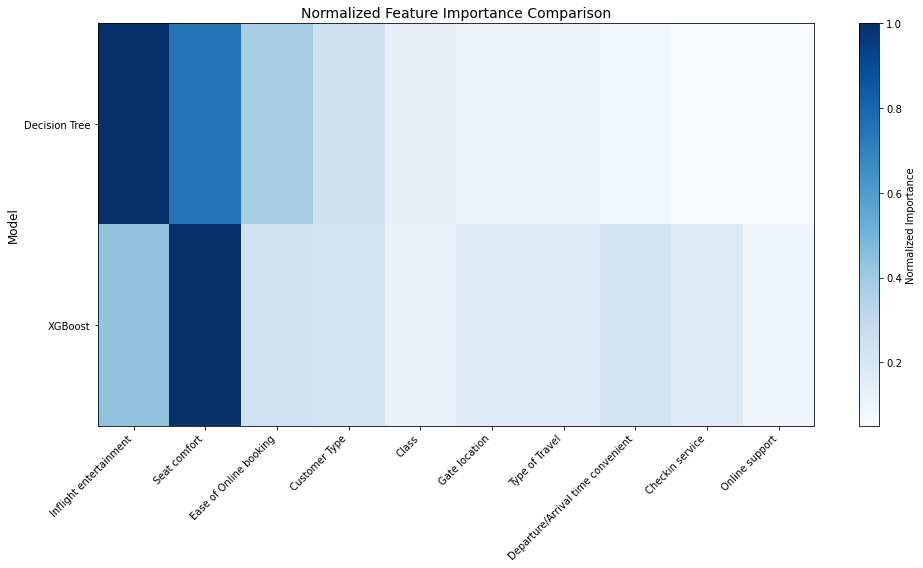

# Airline Customer Satisfaction Analysis 🛫

This repository contains a comprehensive analysis of airline customer satisfaction factors using multiple machine learning approaches. Our models identify key drivers of satisfaction to guide strategic investments in customer experience.

---

## Project Overview 📊

This analysis employs logistic regression, decision tree, random forest, and XGBoost models to identify and validate the key factors driving airline customer satisfaction. Using survey data from 129,880 customers, we provide data-driven insights to guide operational decisions and resource allocation.

---

## Key Findings 🔍

### Primary Driver of Satisfaction

Our models identified different primary drivers of customer satisfaction:

- **Logistic Regression**: Demonstrated the strong correlation between entertainment ratings and satisfaction probability

- **Decision Tree**: Identified in-flight entertainment as the most significant predictor (46% importance)

- **Random Forest**: Confirmed in-flight entertainment as the top feature (similar results to decision tree)

- **XGBoost**: Revealed seat comfort as the dominant factor (83% importance), with in-flight entertainment as the second most influential feature (36%)

This difference in findings between earlier models and XGBoost provides valuable insights into the complex dynamics of customer satisfaction.

### Feature Importance Comparison

The comparison between model feature importance rankings reveals interesting patterns:

### Key Satisfaction Factors Identified by XGBoost

The XGBoost analysis revealed a more nuanced hierarchy of importance:

- **Seat comfort** (83% importance) - overwhelmingly dominant

- **In-flight entertainment** (36% importance) - substantial secondary factor

- **Ease of online booking** (20% importance)

- **Food and drink** (20% importance)

- **Customer loyalty status** (18% importance)

### Critical Experience Thresholds

Our analysis across models identified key satisfaction thresholds:

- Entertainment ratings between 2-3 represent a critical transition zone

- Improvements in seat comfort show the highest potential ROI for satisfaction gains

- The relationship between service quality and satisfaction follows non-linear patterns

### XGBoost Model Visualization

The feature importance visualization from our XGBoost model shows the relative impact of different factors:

---

## Models and Performance 📈

### Comprehensive Model Comparison

| Model | Accuracy | Precision | Recall | F1 Score |
|---------------------|----------|-----------|---------|----------|
| Logistic Regression | 79.89% | 81.60% | 82.15% | 81.87% |
| Decision Tree | 94.33% | 94.44% | 94.35% | 94.39% |
| Random Forest | 93.87% | 93.48% | 94.64% | 94.06% |
| XGBoost | 90.18% | 91.19% | 90.92% | 91.06% |
The performance metrics show that tree-based models (Decision Tree, Random Forest, and XGBoost) all substantially outperform logistic regression, confirming the non-linear nature of satisfaction factors. Interestingly, the simpler Decision Tree model achieved the highest overall accuracy and F1 score in this dataset.

### Model Selection Considerations

- **Decision Tree**: Highest accuracy and interpretability

- **Random Forest**: Excellent performance with better generalization

- **XGBoost**: Strong performance with unique insights on feature importance

- **Ensemble Approach**: Combining insights from all models provides the most comprehensive understanding

### Data Processing Challenges

During our modeling process, we encountered and addressed several data challenges:

- **Missing Values**: Handled 393 rows with missing values (particularly in Arrival Delay)

- **Categorical Encoding**: Properly encoded satisfaction and other categorical variables

- **Class Imbalance**: Managed slight imbalance (54.7% satisfied vs. 45.3% dissatisfied)

- **Data Leakage**: Identified and resolved potential leakage issues in feature selection

---

## Strategic Recommendations 💡

Based on our multi-model analysis, we recommend:

1. **Prioritize seat comfort improvements**

- XGBoost identified this as the dominant satisfaction driver

- Focus on ergonomics, space, and quality materials

2. **Enhance in-flight entertainment**

- Consistently ranked as a top-2 factor across all models

- Focus on content variety, system responsiveness, and user experience

3. **Streamline online booking processes**

- Ranked as the third most important factor in the XGBoost model

- Optimize the digital experience to reduce friction points

4. **Improve food and beverage offerings**

- Identified as having significant impact by the XGBoost model

- Consider quality and variety improvements

5. **Implement predictive satisfaction modeling**

- Deploy our high-accuracy models to identify potentially dissatisfied customers

- Enable proactive service recovery opportunities

6. **Develop tailored experiences for loyalty program members**

- Customer type emerged as an important factor across models

- Create differentiated experiences for loyal customers

---

## Repository Contents 📁

1. **Data Files**

- [Invisto Airline Data](invisto-airline.csv) (CSV)

2. **Python Scripts**

- [Airline Logistic Regression](airline-cs-logistic-regression.py) (PY)

- [Airline Decision-Tree Analysis](airline-cs-decision-tree.py) (PY)

- [Airline Random Forest](airline-cs-random-forest.py) (PY)

- [Airline XGBoost Analysis](airline-cs-xgboost.py) (PY)

3. **Visualizations**

- [Confusion Matrix](confusion-matrix.png) (PNG)

- [Hyper-tuned Decision Tree](decision-tree-hypertuned.png) (PNG)

- [Decision Tree](decision-tree.png) (PNG)

- [Ranked Features](features-ranked.png) (PNG)

- [XGBoost Features](xgboost-features.png) (PNG)

- [Inflight Entertainment Rating](inflight-entertainment-rating.png) (PNG)

- [Model Comparison](model-comparison.png) (PNG)

---

## Model Evolution 🧠

This project demonstrates a progression of increasingly sophisticated modeling approaches:

1. **Logistic Regression**: Provided a baseline model with good interpretability but limited capacity for non-linear relationships.

2. **Decision Tree**: Significantly improved performance by capturing non-linear patterns and feature interactions.

3. **Random Forest**: Further refined our predictive capabilities through ensemble learning, offering robustness against overfitting.

4. **XGBoost**: Added gradient boosting capabilities and revealed new insights about feature importance hierarchy.

Each model contributed unique perspectives to our understanding of customer satisfaction dynamics, demonstrating the value of employing multiple modeling approaches.

---

## Future Work 🚀

Potential extensions of this analysis include:

- Neural network approaches for handling complex interaction effects

- Time-series analysis to track satisfaction changes after service improvements

- Cluster analysis to identify distinct customer segments with different satisfaction drivers

- Deployment of a real-time satisfaction prediction system

- Bayesian modeling for quantifying uncertainty in predictions

---

## Contact Information ✉️

For inquiries about this analysis:

- [LinkedIn Profile](https://www.linkedin.com/in/melissaslawsky/)

- [Client Results](https://melissaslawsky.com/portfolio/)

- [Tableau Portfolio](https://public.tableau.com/app/profile/melissa.slawsky1925/vizzes)

- [Email](mailto:melissa@melissaslawsky.com)

---

© Melissa Slawsky 2025. All Rights Reserved.
