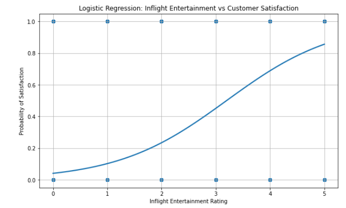
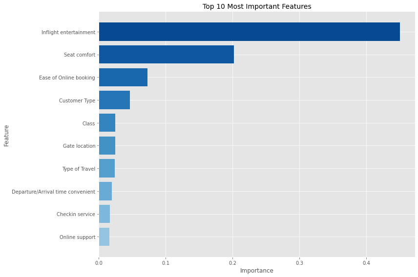
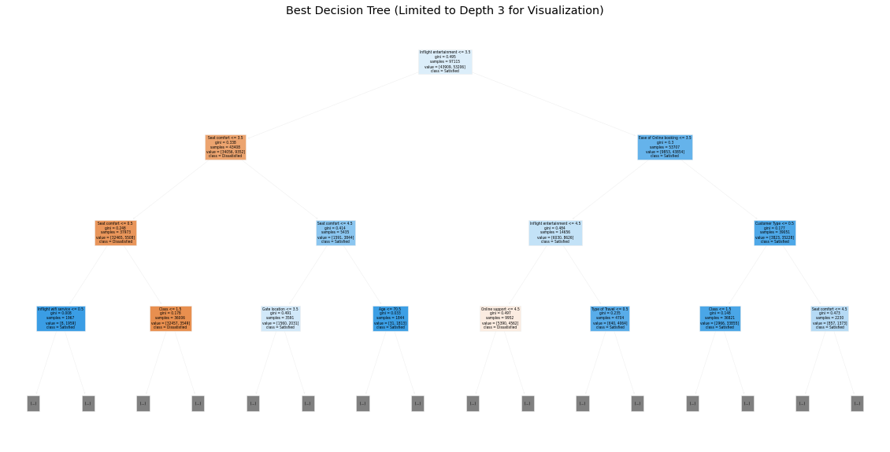
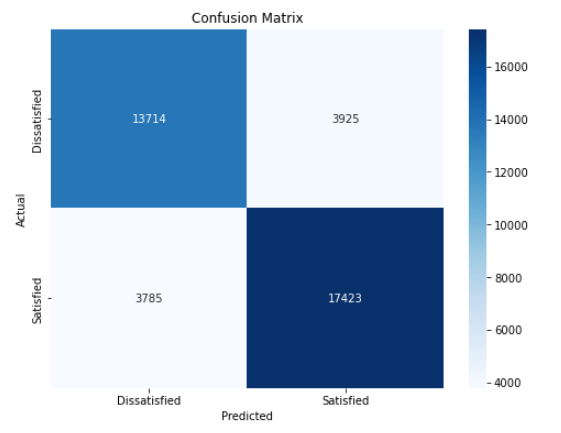

# Airline Customer Satisfaction Analysis 🛫

This repository contains a comprehensive analysis of airline customer satisfaction factors using multiple machine learning approaches. Our models identify key drivers of satisfaction to guide strategic investments in customer experience.

---

## Project Overview 📊

This analysis employs both logistic regression and decision tree models to identify and validate the key factors driving airline customer satisfaction. Using survey data from 129,880 customers, we provide data-driven insights to guide operational decisions and resource allocation.

---

## Key Findings 🔍

### Primary Driver of Satisfaction

Both models consistently identified **in-flight entertainment** as the most significant predictor of customer satisfaction:

- **Logistic Regression**: Demonstrated the strong correlation between entertainment ratings and satisfaction probability
- **Decision Tree**: Quantified that in-flight entertainment accounts for approximately 46% of the impact on satisfaction prediction

### Feature Importance Ranking

Our decision tree model clearly identified the hierarchical importance of different features:

### Secondary Factors of Importance

The decision tree analysis revealed additional important factors:
- **Seat comfort** (20% importance)
- **Ease of online booking** (8% importance)
- **Customer type** and **class of travel** (smaller but notable impacts)

### Critical Thresholds

Our analysis identified key satisfaction thresholds:
- Entertainment ratings between 2-3 represent the critical transition zone
- Customers rating entertainment 4-5 have >70% probability of overall satisfaction
- Customers rating entertainment below 2 have <20% probability of satisfaction

### Decision Tree Visualization

The visualization below shows how the model makes decisions, with in-flight entertainment as the top-level split:

---

## Models and Performance 📈

### Logistic Regression Model
- **Accuracy**: 80.15%
- **Precision**: 81.61%
- **Recall**: 82.15%
- **F1 Score**: 81.88%

### Decision Tree Model
- **Accuracy**: 94.02%
- **Precision**: 95.41%
- **Recall**: 93.55%
- **F1 Score**: 94.47%

The decision tree model's confusion matrix shows excellent classification performance:

The significantly higher performance of the decision tree model suggests that customer satisfaction involves non-linear relationships and interaction effects between variables.

---

## Strategic Recommendations 💡

Based on our multi-model analysis, we recommend:

1. **Prioritize in-flight entertainment improvements**
   - Focus on bringing the entertainment experience from "average" (2-3) to "good" (4+)
   - This represents the highest ROI opportunity for satisfaction improvement

2. **Invest in seat comfort enhancements**
   - As the second most important factor, seat ergonomics and quality improvements will yield significant satisfaction gains

3. **Streamline online booking processes**
   - Optimizing the digital booking experience can drive meaningful satisfaction increases

4. **Implement predictive satisfaction modeling**
   - Deploy our high-accuracy model (94%) to identify potentially dissatisfied customers before journey completion
   - Enable proactive service recovery opportunities

---

## Repository Files 📁

### Data Files
- invisto-airline.csv (CSV)

### Python Scripts
- airline-cs-logistic.py (PY)
- airline-cs-decision-tree.py (PY)

### Visualizations
- confusion-matrix.png (PNG)
- decision-tree-tuned.png (PNG)
- decision-tree.png (PNG)
- features-ranked.png (PNG)
- inflight-entertainment-rating.png (PNG)

---

## Future Work 🚀

Potential extensions of this analysis include:
- Ensemble methods combining multiple models for even higher accuracy
- Time-series analysis to track satisfaction changes after service improvements
- Cluster analysis to identify distinct customer segments with different satisfaction drivers
- Deployment of a real-time satisfaction prediction system

---

## Contact Information ✉️

For inquiries about this analysis:
- [LinkedIn Profile](https://www.linkedin.com/in/melissaslawsky/)
- [Client Results](https://melissaslawsky.com/portfolio/)
- [Tableau Portfolio](https://public.tableau.com/app/profile/melissa.slawsky1925/vizzes)
- [Email](mailto:melissa@melissaslawsky.com)

---

© Melissa Slawsky 2025. All Rights Reserved.
