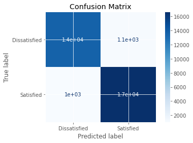

# Airline Customer Satisfaction Prediction 🛫

**Customer Satisfaction and Inflight Entertainment Analysis**  
This project explores how customer satisfaction can be predicted based on in-flight entertainment ratings, using logistic regression. The airline is particularly interested in understanding how improvements in entertainment quality might lead to higher satisfaction levels, ultimately guiding operational decisions and resource allocation.

---

## Executive Summary & Key Insights 📄

This analysis demonstrates the power of inflight entertainment ratings in predicting overall customer satisfaction. Using logistic regression, we found:

1. **Key Driver of Satisfaction**: 
   - **Inflight Entertainment** is the most significant predictor of customer satisfaction.
   - **Impact**: Enhancing entertainment quality can significantly improve satisfaction levels.
   - **Threshold Insight**: Ratings between 2 and 3 on a 5-point scale have the greatest impact on satisfaction. Improving entertainment from "average" to "good" dramatically increases satisfaction.

2. **Customer Satisfaction Prediction**: 📈
   - Customers with ratings of 4-5 for entertainment have a greater than 70% chance of being satisfied.
   - Customers with ratings below 2 have less than a 20% chance of being satisfied.
   
3. **Model Accuracy**: ✅
   - The logistic regression model correctly classifies about 80% of customers' satisfaction levels.
   - **Key Metrics**: Accuracy: 80.15%, Precision: 81.61%, Recall: 82.15%, F1 Score: 81.88%.

---

## Business Applications & Strategic Impact 💡

The insights gained from this analysis are critical for enhancing customer satisfaction and guiding investment decisions in customer service:

1. **Targeted Investment in Entertainment**: 
   - Focus on improving entertainment experiences, especially for customers rating it as average (2-3). These customers show the highest potential for satisfaction improvement.
   
2. **Operational Efficiency**:
   - By investing in the most impactful aspects of the customer experience, airlines can optimize resources and maximize return on investment (ROI) in customer satisfaction initiatives.
   
3. **Customer Segmentation**:
   - Develop tailored marketing strategies for customers with lower satisfaction potential by targeting entertainment improvements in the critical 2-3 rating range.

4. **Continuous Improvement**:
   - Use this model to track changes in satisfaction over time and adapt strategies for enhancing inflight services, ensuring sustainable improvement in customer loyalty.

---

## Methodology & Insights 🔍

### Data Preparation & Exploration
- **Data Source**: The dataset includes 129,880 customer records, featuring variables like customer type, age, travel class, and in-flight services.
- **Key Variables**: Inflight entertainment ratings and customer satisfaction levels were the focus of this analysis.

### Logistic Regression Model
- **Model Approach**: A binomial logistic regression model was used to predict customer satisfaction based on inflight entertainment ratings.
- **Predictive Power**: The logistic regression model demonstrated a strong correlation, providing actionable predictions for customer satisfaction.

### Model Evaluation
- **Evaluation Metrics**:
   - The model achieved an accuracy of **80.15%**, providing reliable predictions.
   - Precision and recall values indicated a balanced approach in predicting both satisfied and dissatisfied customers.

### Visualization: Inflight Entertainment vs Satisfaction
- A logistic regression curve was plotted, showcasing the S-shaped relationship between entertainment ratings and customer satisfaction. This curve highlights where small improvements in entertainment can lead to significant increases in satisfaction.

---

## Technical Analysis (For Reference) 📊

1. **Logistic Regression Coefficients**:
   - **Intercept**: -3.19
   - **Coefficient for Inflight Entertainment**: 0.9975
   - The model's coefficients indicate a positive relationship between entertainment ratings and satisfaction.

2. **Confusion Matrix**:
   - The model successfully identified satisfied and dissatisfied customers, with only minor errors in prediction. False positives (predicting satisfaction when not satisfied) and false negatives (missing satisfied customers) were balanced, ensuring fair performance.

---

## Recommendations & Next Steps 📅

1. **Invest in Entertainment Improvements**:
   - Focus on enhancing the entertainment experience for customers in the 2-3 rating range, as this offers the highest potential for improving satisfaction.

2. **Expand the Model**:
   - Incorporate other factors affecting satisfaction, such as food quality, seat comfort, and staff service, to create a more comprehensive prediction model.

3. **Monitor and Adapt**:
   - Continuously monitor customer satisfaction trends and adapt the model as new data becomes available, ensuring strategies stay aligned with evolving customer preferences.

---

## Conclusion 🚀

This analysis underscores the significant role of inflight entertainment in shaping customer satisfaction. By focusing on this key driver, airlines can prioritize customer experience improvements, ensuring higher satisfaction and loyalty while optimizing operational costs.

---

## Contact ✉️

For inquiries about this analysis:
- [LinkedIn Profile](https://www.linkedin.com/in/melissaslawsky/)
- [Client Results](https://melissaslawsky.com/portfolio/)
- [Tableau Portfolio](https://public.tableau.com/app/profile/melissa.slawsky1925/vizzes)
- [Email](mailto:melissa@melissaslawsky.com)

---

© Melissa Slawsky 2025. All Rights Reserved.
